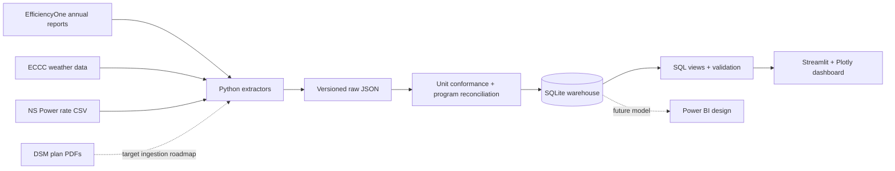

# Joule Ledger

[](https://github.com/beaprogram/Joule-Ledger/actions/workflows/ci.yml)

An auditable Python-to-SQL pipeline and Streamlit dashboard for exploring program-level actuals reported by EfficiencyOne/Efficiency Nova Scotia.

## Current status

This repository is an active data product, not yet a complete plan-versus-actual audit.

| Capability | Status |
|---|---|
| Annual-report actuals | **Implemented:** 66 source-linked fact rows covering 2022–2024 |
| Program reconciliation | **Implemented:** 28 canonical program definitions; no unknown IDs in the current warehouse |
| Weather context | **Implemented:** ECCC-derived weather dimension and a transparent HDD-ratio view |
| Streamlit dashboard | **Implemented:** five-page application with graceful handling for missing targets |
| Automated tests and validation | **Implemented:** pytest plus five SQL-backed warehouse checks |
| DSM plan targets | **Not loaded:** `fact_targets` currently contains zero rows |
| Power BI model | **Design only:** page specifications and DAX examples exist, but no `.pbix` file is committed |
| 2019–2021 program actuals | **Not loaded:** cached source placeholders exist, but the warehouse begins in 2022 |

The status table is intentionally explicit so reviewers can distinguish working evidence from the roadmap.

## What you can explore today

- Annual electricity savings totals for 2022, 2023, and 2024.
- Program-level energy and GHG actuals with original source page/path fields.
- Reconciled program names and low-income/category metadata.
- Weather-normalized views using a documented HDD-ratio method.
- Data completeness, referential integrity, uniqueness, and mapping checks.

See [docs/findings.md](docs/findings.md) for observations that can be reproduced from the committed warehouse. The project does not currently support claims about target variance, spending, participation, or six-year trends.

## Architecture



Solid lines are runnable today. Dotted lines are incomplete or planned.

## Data coverage

The committed `data/warehouse.db` currently contains:

| Year | Fact rows | Electric savings |
|---:|---:|---:|
| 2022 | 23 | 121.4 GWh |
| 2023 | 21 | 131.0 GWh |
| 2024 | 22 | 174.4 GWh |

These are pipeline totals, not independent evaluation findings. Source provenance is retained on fact rows, and the project disclaimer applies to all interpretations.

## Quickstart

Requires Python 3.11 or later.

```bash
git clone https://github.com/beaprogram/Joule-Ledger.git
cd Joule-Ledger

python -m venv .venv
source .venv/bin/activate  # Windows: .venv\Scripts\activate
python -m pip install -r requirements.txt

pytest
python pipeline.py --validate
streamlit run app.py
```

The dashboard opens at `http://localhost:8501` by default.

## Rebuild the warehouse

The committed raw JSON can rebuild the warehouse without downloading PDFs:

```bash
python pipeline.py --transform
python pipeline.py --validate
```

`python pipeline.py --refresh` attempts extraction as well. Review [docs/control_procedures.md](docs/control_procedures.md) before using it: older annual reports and DSM plan PDFs require manual source placement, and cached placeholders must not be mistaken for extracted facts.

## Validation

`python pipeline.py --validate` exits non-zero when any implemented check fails:

1. Actual fact rows contain at least one energy metric and no negative core measures.
2. Required measured columns are populated for loaded fact rows.
3. Every fact row resolves to a valid program ID.
4. Exact duplicate fact records are absent.
5. Active programs do not have a closing `valid_to` value.

GitHub Actions runs the unit tests and warehouse validation on pull requests and pushes to `main`.

## Repository map

```text
app.py                 Streamlit application
pipeline.py            Extract/transform/validate entry point
extractors/            Annual report, plan, weather, and rate readers
transforms/            Unit conformance, mapping, and warehouse loading
sql/                   Schema, views, and canonical program map
data/raw/              Versioned source extracts and placeholders
data/warehouse.db      Reproducible SQLite warehouse
tests/                 Extractor and reconciliation tests
docs/                  Methods, controls, findings, and screenshot guide
dashboard/README.md    Current Streamlit and future Power BI presentation notes
```

## Roadmap

- [ ] Load and source-review 2019–2021 program actuals.
- [ ] Ingest DSM plan targets and populate `fact_targets`.
- [ ] Add target/actual reconciliation checks backed by a versioned reference table.
- [ ] Capture dashboard screenshots and publish a stable Streamlit demo.
- [ ] Add a Power BI file only after the model is complete and redistributable.
- [ ] Revisit plan-vs-actual and equity findings after spend, participant, and target data exist.

## Documentation

- [Project description](PROJECT_DESCRIPTION.md)
- [ETL design](docs/etl_design.md)
- [Data dictionary](docs/data_dictionary.md)
- [Control procedures](docs/control_procedures.md)
- [Reproducible observations](docs/findings.md)
- [Dashboard status](dashboard/README.md)

## Disclaimer

This independent portfolio project is not affiliated with or endorsed by EfficiencyOne or Efficiency Nova Scotia. It uses public source material, and any errors or interpretations are the author's own.

## License

MIT. See [LICENSE](LICENSE).
